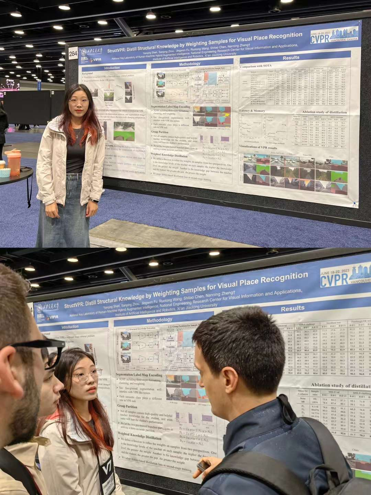
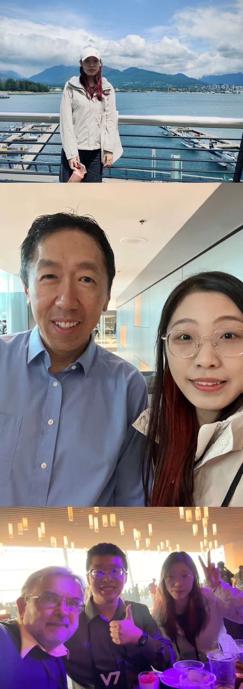
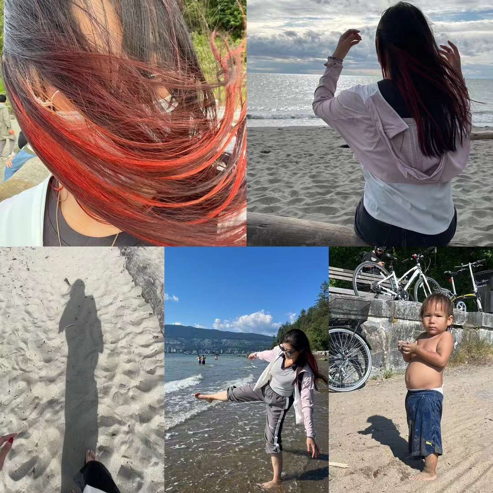
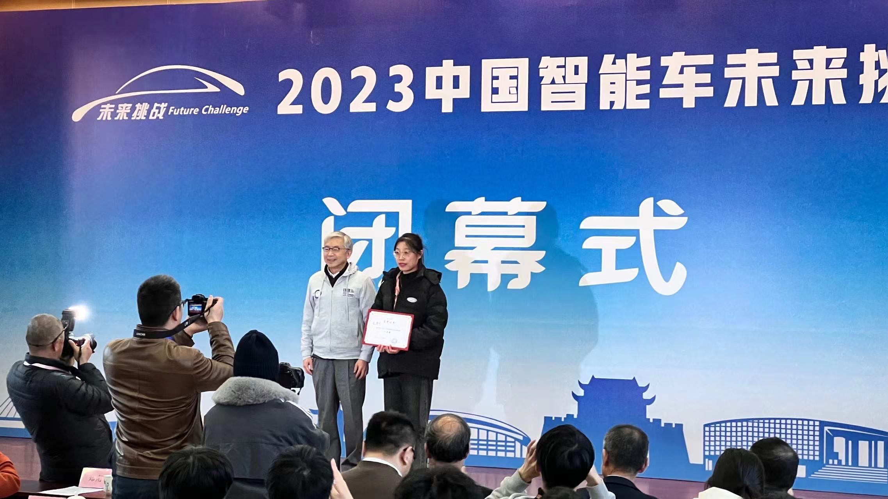
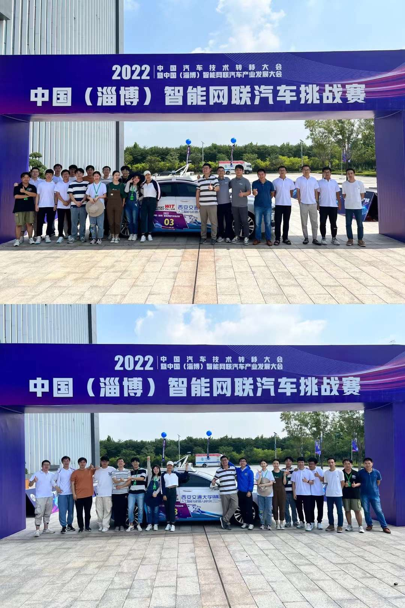



Hope to explore more and enjoy more :\)

CVPR2023 in Canada
==================

{:height="50%" width="50%"}

{:height="50%" width="50%"}

{:height="50%" width="50%"}

PS: not in a bar, but the CVPR banquet! Super!

<video width="480" height="480" controls="">
    <source src="../images/cvpr4.mp4" type="video/mp4">
</video>

<!-- <iframe 
src="../images/cvpr4.mp4" 
scrolling="no" border="0" frameborder="no" framespacing="0" allowfullscreen="true"> 
</iframe> -->

Intelligent Vehicles Future Challenge (IVFC) 2023
=================================================
We won the championship!

{:height="50%" width="50%"}

Intelligent Connected Car Challenge 2022
========================================
We won the championship!

{:height="50%" width="50%"}
