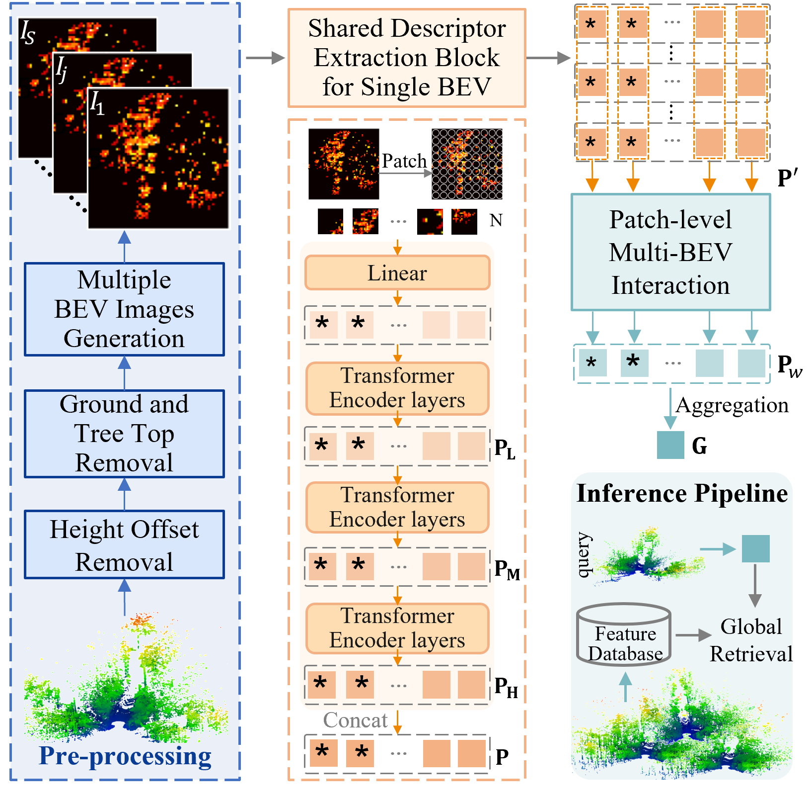

Place recognition is essential to maintain global consistency in large-scale localization systems. While research in urban environments has progressed significantly using LiDARs or cameras, applications in natural forest-like environments remain largely under-explored. Furthermore, forests present particular challenges due to high self-similarity and substantial variations in vegetation growth over time. In this work, we propose a robust LiDAR-based place recognition method for natural forests, ForestLPR. We hypothesize that a set of cross-sectional images of the forest's geometry at different heights contains the information needed to recognize revisiting a place. The cross-sectional images are represented by \ac{bev} density images of horizontal slices of the point cloud at different heights. Our approach utilizes a visual transformer as the shared backbone to produce sets of local descriptors and introduces a multi-BEV interaction module to attend to information at different heights adaptively. It is followed by an aggregation layer that produces a rotation-invariant place descriptor. We evaluated the efficacy of our method extensively on real-world data from public benchmarks as well as robotic datasets and compared it against the state-of-the-art (SOTA) methods. The results indicate that ForestLPR has consistently good performance on all evaluations and achieves an average increase of 7.38% and 9.11% on Recall@1 over the closest competitor on intra-sequence loop closure detection and inter-sequence re-localization, respectively, validating our hypothesis.Visual place recognition is a challenging task for autonomous driving and robotics, which is usually considered as an image retrieval problem.
A commonly used two-stage strategy involves global retrieval followed by re-ranking using patch-level descriptors.
Most deep learning-based methods in an end-to-end manner cannot extract global features with sufficient semantic information from RGB images.
In contrast, re-ranking can utilize more explicit structural and semantic information in one-to-one matching process, but it is time-consuming.
To bridge the gap between global retrieval and re-ranking and achieve a good trade-off between accuracy and efficiency, we propose StructVPR++, a framework that embeds structural and semantic knowledge into RGB global representations via segmentation-guided distillation.
{Our key innovation lies in decoupling label-specific features from global descriptors, enabling explicit semantic alignment between image pairs without requiring segmentation during deployment.}
{Furthermore, we introduce a sample-wise weighted distillation strategy that prioritizes reliable training pairs while suppressing noisy ones.}
{Experiments on four benchmarks demonstrate that StructVPR++ surpasses state-of-the-art global methods by 5-23\% in Recall@1 and even outperforms many two-stage approaches, achieving real-time efficiency with a single RGB input.}
