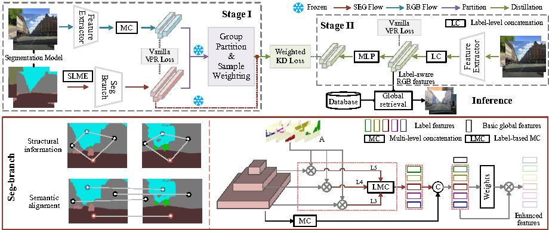

Visual place recognition is a challenging task for autonomous driving and robotics, which is usually considered as an image retrieval problem. A commonly used two-stage strategy involves global retrieval followed by re-ranking using patch-level descriptors. Most deep learning-based methods in an end-to-end manner cannot extract global features with sufficient semantic information from RGB images. In contrast, re-ranking can utilize more explicit structural and semantic information in one-to-one matching process, but it is time-consuming. To bridge the gap between global retrieval and re-ranking and achieve a good trade-off between accuracy and efficiency, we propose StructVPR++, a framework that embeds structural and semantic knowledge into RGB global representations via segmentation-guided distillation.
Our key innovation lies in decoupling label-specific features from global descriptors, enabling explicit semantic alignment between image pairs without requiring segmentation during deployment. Furthermore, we introduce a sample-wise weighted distillation strategy that prioritizes reliable training pairs while suppressing noisy ones. Experiments on four benchmarks demonstrate that StructVPR++ surpasses state-of-the-art global methods by 5-23% in Recall@1 and even outperforms many two-stage approaches, achieving real-time efficiency with a single RGB input.
